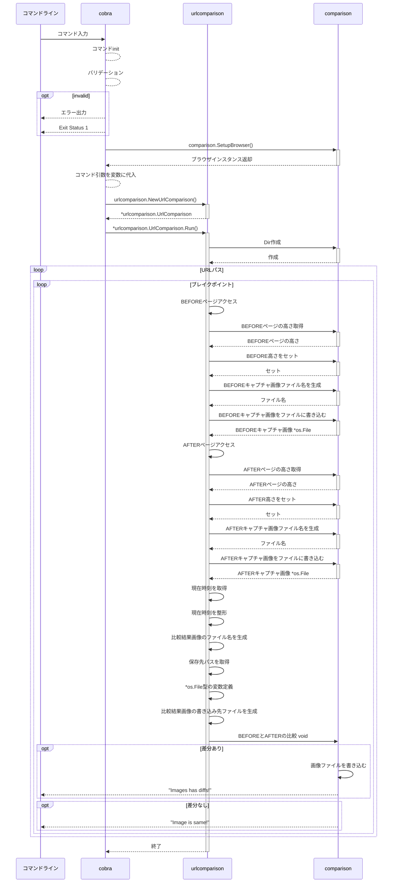

```mermaid
sequenceDiagram
    participant CommandLine as コマンドライン
    participant cobra
    participant u as urlcomparison
    participant c as comparison

    CommandLine ->> cobra: コマンド入力
    cobra --> cobra: コマンドinit
    cobra --> cobra: バリデーション
    
    opt invalid
        cobra -->> CommandLine: エラー出力
        cobra -->> CommandLine: Exit Status 1
    end

    cobra ->>+ c: comparison.SetupBrowser()
    c -->>- cobra: ブラウザインスタンス返却
    cobra --> cobra: コマンド引数を変数に代入
    cobra ->>+ u: urlcomparison.NewUrlComparison()
    u -->>- cobra: *urlcomparison.UrlComparison
    cobra ->>+ u: *urlcomparison.UrlComparison.Run()
    u ->>+ c: Dir作成
    c -->>- u: 作成
    loop URLパス
        loop ブレイクポイント
            u ->> u: BEFOREページアクセス
            u ->>+ c: BEFOREページの高さ取得
            c -->>- u: BEFOREページの高さ
            u ->>+ c: BEFORE高さをセット
            c -->>- u: セット
            u ->>+ c: BEFOREキャプチャ画像ファイル名を生成
            c -->>- u: ファイル名
            u ->>+ c: BEFOREキャプチャ画像をファイルに書き込む
            c -->>- u: BEFOREキャプチャ画像 *os.File
            u ->> u: AFTERページアクセス
            u ->>+ c: AFTERページの高さ取得
            c -->>- u: AFTERページの高さ
            u ->>+ c: AFTER高さをセット
            c -->>- u: セット
            u ->>+ c: AFTERキャプチャ画像ファイル名を生成
            c -->>- u: ファイル名
            u ->>+ c: AFTERキャプチャ画像をファイルに書き込む
            c -->>- u: AFTERキャプチャ画像 *os.File
            u ->> u: 現在時刻を取得
            u ->> u: 現在時刻を整形
            u ->> u: 比較結果画像のファイル名を生成
            u ->> u: 保存先パスを取得
            u ->> u: *os.File型の変数定義
            u ->> u: 比較結果画像の書き込み先ファイルを生成
            u ->> c: BEFOREとAFTERの比較 void

            opt 差分あり
                c ->> c: 画像ファイルを書き込む
                c -->> CommandLine: "Images has diffs!"
            end
            opt 差分なし
                c -->> CommandLine: "Image is same!"
            end
        end
    end
    u -->>- cobra: 終了

```